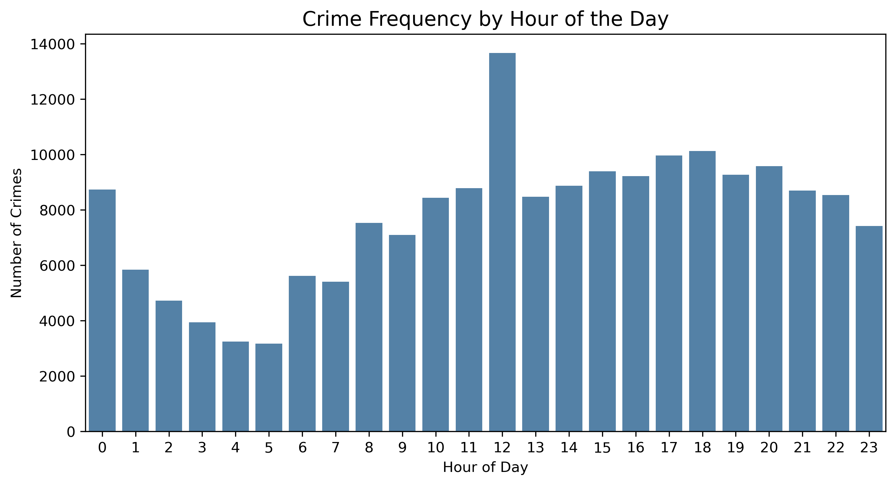
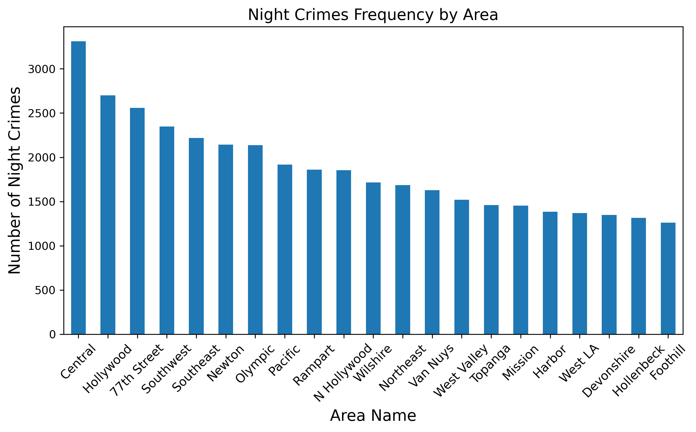

# Los Angeles Crime Analysis (2020–2023)


**Author:** Andreza Eufrasio

**Stack:** Python, pandas, numpy, matplotlib

**Notebook:** [`analyzing_crime_los_angeles_case_study.ipynb`](analyzing_crime_los_angeles_case_study.ipynb)
  
---

## Overview

This project analyzes reported crime incidents in Los Angeles between **January 1, 2020** and **July 3, 2023**. Using Python and pandas, the analysis explores patterns across **time**, **location**, **victim demographics**, and **weapon involvement**.

The notebook was originally developed from an educational DataCamp exercise and expanded into a complete data analytics case study. The project demonstrates **data cleaning**, **feature engineering**, **exploratory data analysis**, **visualization**, and **validation** and **communication of analytical findings.**

---

## Business Context

Understanding when, where, and how reported crimes occur can help public safety organizations identify patterns and better allocate analytical and operational resources.

This case study examines crime data from the perspective of a public safety analyst. The analysis focuses on questions such as:

- prioritizing high-risk time windows
- identifying consistently elevated geographic areas
- understanding which victim groups are most affected
- distinguishing high-volume crimes from high-risk violent offenses

---

## Objectives

The analysis focuses on:

- identifying the most common crime types
- analyzing areas with the highest crime frequency
- examining temporal patterns (hour, weekday vs. weekend)
- exploring victim demographics
- assessing weapon involvement across crime categories

---

## Dataset

- **File:** `data.zip` (compressed dataset containing `crimes.csv`)
- **Source:** DataCamp educational dataset adapted from Los Angeles Open Data
- **Period:** January 1, 2020 – July 3, 2023
- **Unit of analysis:** Each row represents a reported crime incident.

---

### Key Variables

The dataset includes:

- **Crime date and time:** `date_rptd`, `date_occ`, `time_occ`
- **Location:** `area_name`, `location`
- **Crime type:** `crm_cd_desc`
- **Victim demographics:** `vict_age`, `vict_sex`, `vict_descent`
- **Weapon and report information:** `weapon_desc`, `status_desc`

---

### Engineered Features

Additional variables were created to support the analysis:

- `year`
- `month`
- `month_name`
- `day_of_week`
- `hour`
- `minute`
- `time`
- `age_group`
- `weapon_used`
- `day_type`

---

## Key Questions Answered

1. Which hour has the highest frequency of crimes?
2. Which area has the highest frequency of night crimes?
3. How does crime distribution vary by victim age group?
4. What are the top 5 most common crime types?
5. How does crime distribution vary by victim gender?
6. Which area experiences the highest number of crimes during peak crime hours?
7. How do crime patterns differ between weekdays and weekends?
8. Which weekday has the highest crime frequency?
9. How does crime distribution vary by victim descent and gender?
10. How does weapon involvement vary across crime types?

---

### Analytical Methods

The analysis uses several exploratory and descriptive techniques:

- data cleaning and standardization
- missing value detection and placeholder handling
- datetime conversion and time-based feature engineering
- categorical aggregation using `value_counts()`, `groupby()`, and pivot tables
- proportion analysis using normalized counts
- cross-tabulation and heatmap analysis
- validation of selected results using alternative analytical approaches

---

## Data Cleaning & Preparation Highlights

Several preprocessing steps were performed before the analysis:

- standardized column names to lowercase `snake_case`
- preserved leading zeros in `time_occ` before time conversion
- Converted date and time variables into usable datetime formats
- created temporal features such as hour and day of week
- grouped victim ages into interpretable age categories using `pd.cut()`
- created a binary `weapon_used` indicator from `weapon_desc`
- identified and replaced placeholder values such as `"?"`, `"N/A"`, and `"unknown"` with missing values(NaN)
- reviewed ambiguous and low-frequency categories and excluded them where appropriate for clearer interpretation

These steps helped improve consistency and support reproducible analysis throughout the notebook.

---

## Key Findings

### 1) Reported Crime frequency peaks at midday

The highest frequency of reported crimes occurs at **12 PM**, with incident counts remaining elevated through parts of the afternoon.



### 2) Central records the highest number of reported nighttime crimes

The **Central** area records the highest number of reported crimes during nighttime hours.



### 3) Adults aged 26–34 represent the largest victim age group

Victims aged **26–34** account for the largest share of reported incidents, followed by the **35–44** age group. The **0–17** group has the lowest number of reported incidents.

### 4) A small number of crime categories account for many incidents

The most frequently reported categories include:

- identity theft
- battery
- burglary
- assault with a deadly weapon
- intimate partner-related offenses

These categories account for a substantial share of reported incidents in the dataset, highlighting the concentration of crime frequency across a relatively small number of categories.

### 5) Male and female victims are represented at similar levels

Among records with available gender information, male victims account for approximately **50%** of incidents and female victims approximately **48%**. 

This indicates a relatively balanced distribution of reported incidents between male and female victims in the analyzed dataset.

### 6) Peak-hour crime concentration is highest in Central

The **Central** area records the highest number of reported crimes during peak crime hours. Other areas, including **77th Street** and **Pacific**, also show relatively high incident counts during these periods.

### 7) Total reported crime volume is higher on weekdays than weekends

Approximately **71.4%** of reported incidents occur on weekdays and **28.6%** on weekends. Among weekdays, **Friday** has the highest crime frequency.

Because there are five weekdays and two weekend days, total counts alone should not be interpreted as evidence that an individual weekday is necessarily riskier than an individual weekend day. Daily patterns are examined separately in the analysis.

### 8) Friday has the highest crime frequency among weekdays

Among weekdays, Friday records the highest number of reported incidents, followed by Thursday and Wednesday.

The differences across weekdays are relatively modest, indicating that reported crime is distributed throughout the workweek rather than being concentrated on a single day

### 9) Crime distribution varies across victim descent and gender

Crime distribution varies across victim descent and gender, with certain demographic groups experiencing higher concentrations of incidents.

While both male and female victims are represented across all descent categories, some groups show noticeable imbalances, suggesting that crime exposure is not evenly distributed.

Analyzing these variables jointly reveals interaction patterns that would not be apparent when examining gender or descent independently, highlighting the importance of multi-dimensional analysis.

These differences should be interpreted cautiously, as they may reflect underlying population distribution, reporting practices, or socioeconomic factors rather than direct causal relationships.

### 10) Weapon involvement varies substantially across crime types

Most reported incidents in the dataset do not involve a recorded weapon. However, weapon involvement differs considerably by crime category.

Violent offenses such as assault with a deadly weapon and attempted homicide show relatively high levels of weapon involvement, while categories such as identity theft, fraud, and document-related offenses show little or none.

---

## Repository Structure

```text
analyzing_crime_los_angeles_case_study/
├── analyzing_crime_los_angeles_case_study.ipynb   # analysis notebook
├── data.zip                                        # compressed dataset (contains crimes.csv)
├── index.html                                      # rendered project
├── README.md                                       # project overview
└── requirements.txt                                # Python dependencies
```
---

## How to Run the Notebook

1. Clone or download this repository.
2. Extract `data.zip` to access `crimes.csv`.
3. Place the extracted `crimes.csv` file in the same directory as `analyzing_crime_los_angeles_case_study.ipynb`.
4. Install the required Python packages using `requirements.txt`.

```bash
 pip install -r requirements.txt
```

5. Start Jupyter Notebook:
   
```bash
 jupyter notebook
```
   
7. Open and run
analyzing_crime_los_angeles_case_study.ipynb

The notebook contains the complete analysis, visualizations, answers to questions Q1–Q10, and supporting interpretations.

---

 ## Limitations

Several limitations should be considered when interpreting the results:

- The project uses an educational version of the original dataset.
- The analysis is based on **reported incidents**, which may not fully represent all crime that occurred.
- Crime counts are not adjusted for differences in population across geographic or demographic groups.
- Some demographic comparisons may be influenced by population distribution and reporting behavior.
- Variables such as `weapon_desc`, `vict_sex`, and `vict_descent` required data quality handling and should be interpreted carefully.
- The analysis identifies associations and descriptive patterns; it does not establish causal relationships.

---

## Recommendations / Next Steps

Potential extensions of this analysis include:

- analyzing monthly and seasonal crime trends
- comparing average daily crime frequency between weekdays and weekends
- examining geographic hotspots over time
- performing deeper segmentation by crime type, age, gender, and descent
- analyzing weapon involvement by area and time of day
- exploring predictive modeling for high-frequency periods or locations

---

## What This Project Demonstrates

This case study demonstrates an end-to-end exploratory data analysis workflow, including:

- cleaning and preprocessing real-world-style data with pandas
- engineering temporal and categorical features 
- translating analytical questions into structured analyses  
- aggregating and comparing data across multiple dimensions  
- validating selected findings using alternative analytical approaches  
- creating visualizations to communicate patterns  
- distinguishing descriptive findings from interpretations and limitations
- communicating analytical results clearly for a non-technical audience

---
**View the complete analysis:** [Los Angeles Crime Analysis – HTML Report](https://andrezascientist.github.io/analyzing_crime_los_angeles_case_study/)

